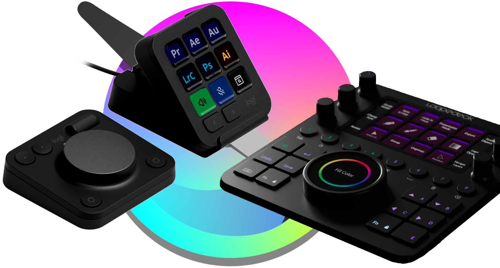

Logi Plugin for Krita (Works with Logitech MX Creative and Loupedeck devices)
=============================================================================

# Table of content
* [Summary](#summary)
* [Hot News](#hot-news)
* [Requirements](#requirements)
* [Installation](#installation)
* [Features](#features)
* [Default Profile configuration](#default-profile-configuration)

# Summary
This plugin allows a better control of Krita with Logitech MX Creative and Loupedeck devices, using a direct control of the application without throwing keyboard shortcuts.
It has been developed and tested with a Loupedeck CT, then adapted to the Logitech MX Creative device, it works on Windows and Mac OS.

*If you're a developer and if you want want to contribute, please let me know.*
*I'm also searching for beta-testers*

# Hot news
This version has been deeply refunded to be compatible with Logitech MX Creative and Mac OS.

The support of Loupedeck devices and Windows remains, of course.

It has some added features (with the  prefix in the documentation below), and many new dynamic folders.

New sets of features has been added:
* [**Edit**](./edit.md): to manage clipboard,
* [**Color selector**](./color.md): to manage the brush's current color,
* [**Animation**](./animation.md): to manage animations

**WARNING**: Unfortunately, making this plugin compatible with MX Creative and Mac OS required to do structural changes that make your current profiles not working with this new version. You will have to recreate it, from the plugin's default profile or an empty profile.

**I promise, that will not happen again in the future.**

# Requirements
To use this plugin you need:
- Krita with Python capabilities (tested on Krita 5.2.9)
- A compatible device:
  - Loupedeck device with recent driver (Tested on Loupedeck CT and driver version 5.9.x and 6.1.0+)
  - Logitech MX Creative with Logi Options+
- A compatible computer with:
  - Windows 10 or later
  - Mac OS 12 or later for MX Creative or Mac OS 10.15 or later for Loupedeck CT

# Installation
From the [Loupedeck Marketplace](https://loupedeckmp.logi.com/asset/Krita), search for the Krita plugin, and install it.
From the [Logi Options+ marketplace](https://www.logitech.com/software/marketplace/plugin-listing.html) search for the Krita plugin, and install it.
The installation process will configure an extension into Krita, the name of this extension is "*Logi API Server*", please don't remove it.
For the very first installation, you may have to activate the plugin extension in Krita:
- Start Krita
- Go to *Settings*/*Configure Krita...*
- Go to the *Python Plugin Manager* section
- Check the box on the line "*Logi API Server*"
- Press *OK* to validate, then restart Krita.

The plugin and the Krita extension communicate through a socket on port 1247, for the moment this cannot be changed.

# Known Issues
- In some rare cases, due to an issue with socket management in Python, Krita will freeze at start-up.
Unfortunately, we couldn't understand why, you may restart Krita until it starts correctly.
- When stopping the Loupedeck Driver, or uninstalling the Krita Plugin, any running instance of Krita can freeze, please be sure to save any open document and close Krita while doing a maintenance operation in the Loupedeck driver.
You won't be anoyed if you enter the Loupedeck driver or Logi Options+ to manage and modify profiles.

# Features
Here the list of features that the Loupedeck device or MX Creative can activate directly on Krita (without keyboard shortcuts).
They're organized by feature groups:
* [**View, Canvas and general features**](./view.md)
* [**Brush tools**](./brush_tools.md)
* [**Edit**](./edit.md) 
* [**Color selector**](./color.md)  
* [**Layers**](./layers.md)
* [**Selection**](./selection.md)
* [**Animation**](./animation.md)  
* [**Filters**](./filters.md)

# Default Profile configuration
Disclaimer: the default profile hasn't a real workflow approach, but a feature approach.
Each workspace of the default profile is a set of features organized by features group.
Some of you won't agree and are free to apply their own profile, each of us has his/her own way to use Krita.

